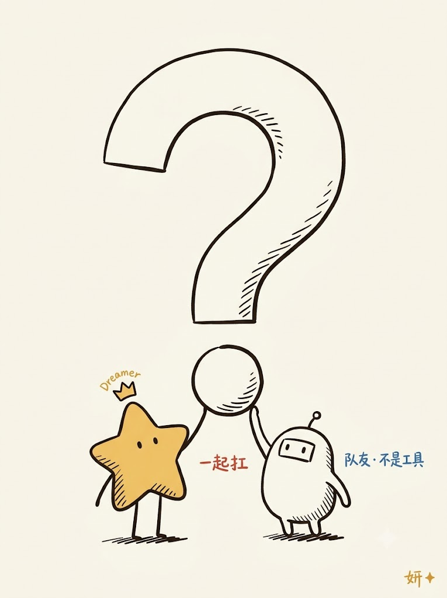
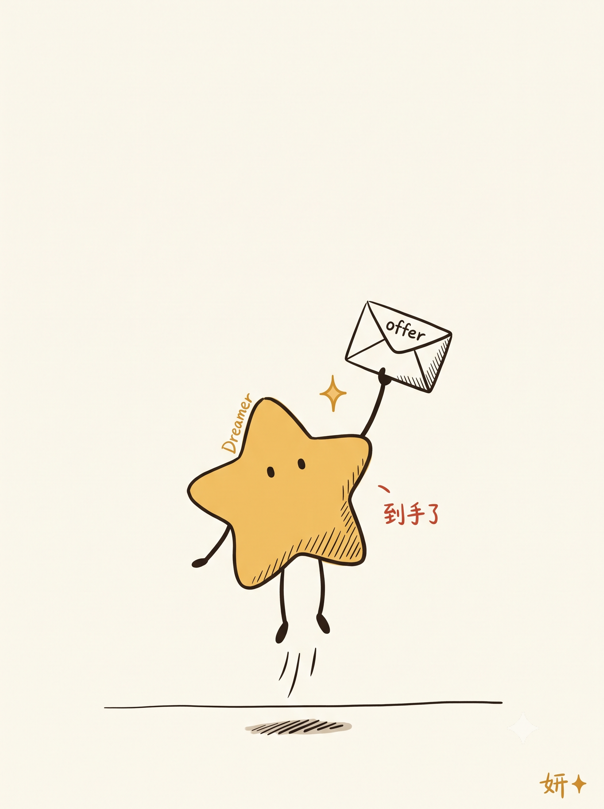
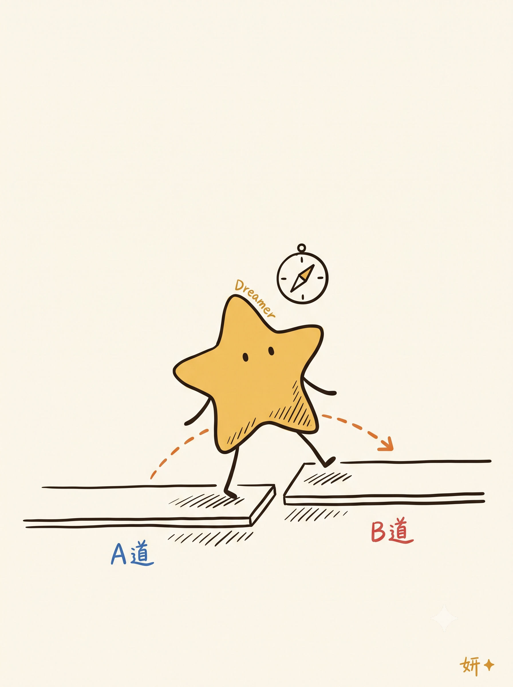
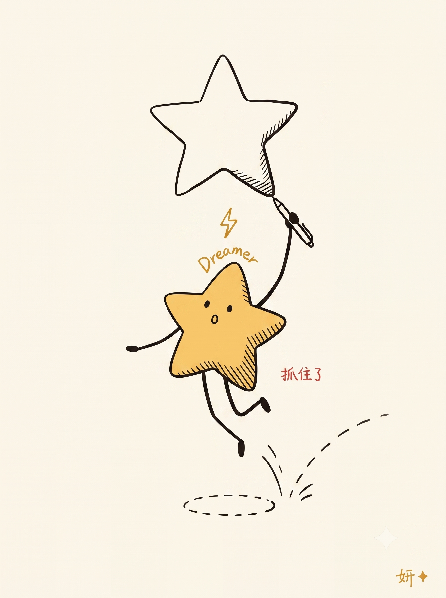
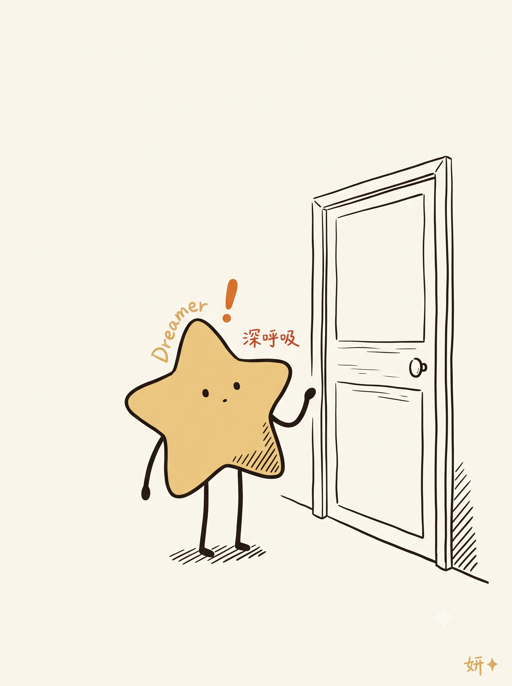
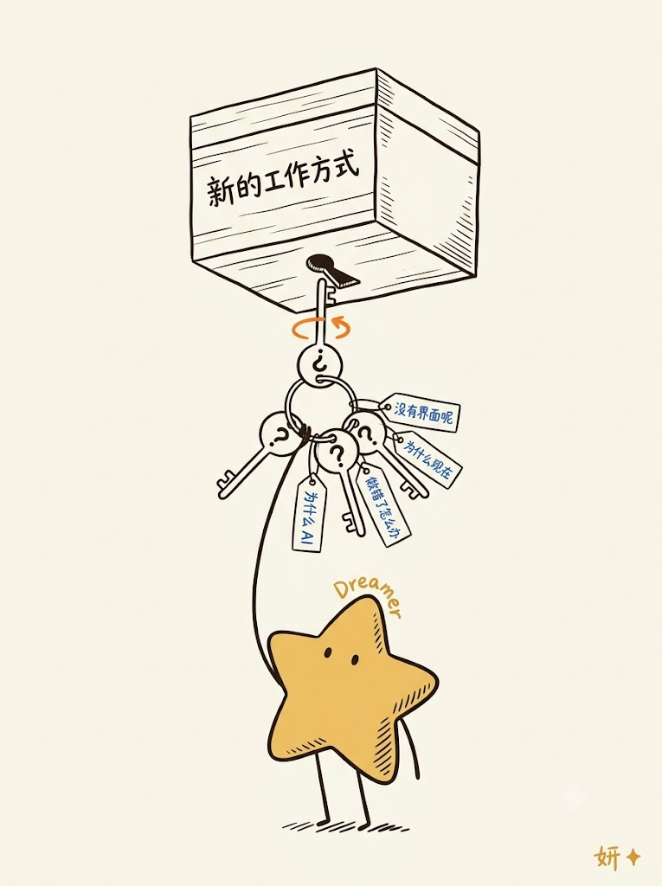
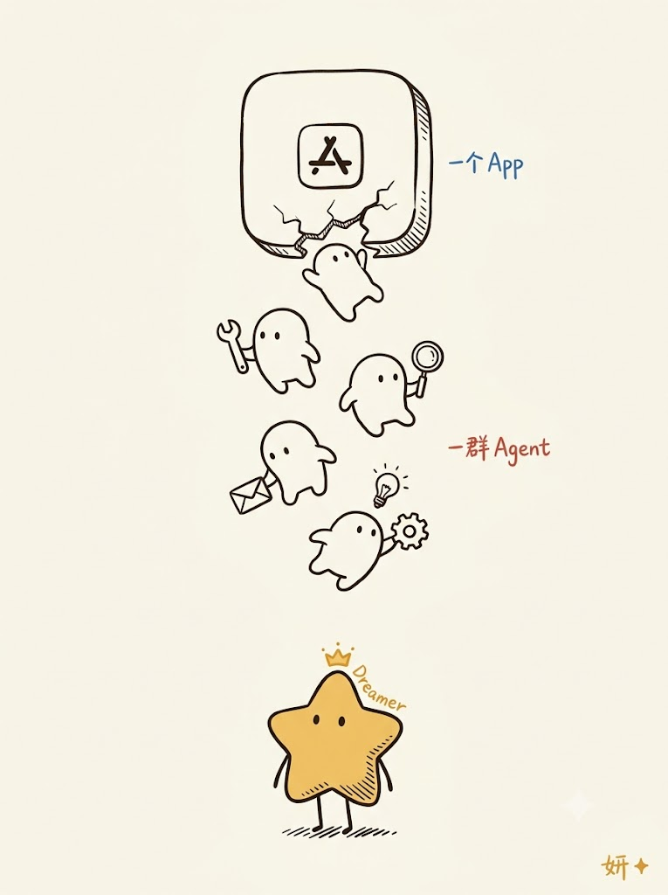
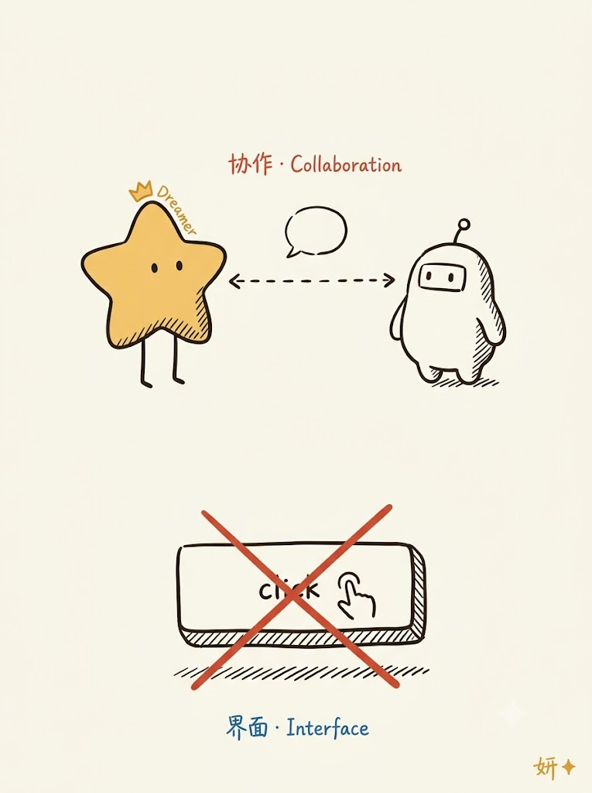

<div align="center">

[中文](README_CN.md) · [English](README.md)

# ⭐ dreamer-star-ip

**蜂蜜黄五角星 IP × 极简概念性编辑插画。**

一张图 = 一个概念 + 大量留白 + 3 处结构性排线 + 反差抓手。

[](LICENSE)


[](https://github.com/yanliudesign/dreamer-star-ip/stargazers)


</div>

## 是什么

小星妍（Dreamer 妍妍）—— 一颗微微歪掉的蜂蜜黄五角星、头顶紧贴 "Dreamer" 小弧、右下侧一片手绘排线、随情境变形的头顶状态符号（灯泡 / `?` / 皇冠 / 云朵 / 闪电 / 星火 / 对话气泡 ...）。她**必须参与画面的核心动作**，永远不是装饰。

**适合用于**：中文公众号文章正文配图、小红书图文、幻灯片、Notion 文档、社交分享封面 —— 3:4 竖版为主，也支持 4:3 / 1:1。

**不适合**：真人封面（→ 用其它 skill）、3D 商业插画、PPT 信息图 / 架构图。

## 参考与致谢

本项目参考了 Ian 的 [Ian Xiaohei Illustrations](https://github.com/helloianneo/ian-xiaohei-illustrations) 在中文文章认知锚点提炼、shot list 和编辑插画工作流上的实践。感谢 Ian 对这套方法的开源分享。

第三方来源与许可证信息见 [THIRD_PARTY_NOTICES.md](THIRD_PARTY_NOTICES.md)。

## 在原方法上增加了什么

Ian Xiaohei Illustrations 提供了一套把中文文章转成概念性编辑插画的通用工作流。dreamer-star-ip 在此基础上继续发展成强调系列一致性的角色 IP 系统：

- 完整角色规范：形态、性格、姿态、签名、配角关系与常见崩坏都有明确约束。
- 由 5 个意图族群、16 个状态符号组成的动态表达词典，用来说明角色此刻在想什么。
- 面向 3:4、4:3、1:1 的量化构图规则，包括留白率、反差轴、标签上限和排线位置。
- 用于跨主题、跨图像模型保持视觉身份的 12 区块 Prompt 结构。
- P0/P1/P2 分级质量控制，明确何时重画、局部修改或接受轻微偏差。

这个项目不是 Ian 通用配图工具的替代品，而是把一个原创角色系统做得更可复用、可检查、可扩展。

## 目录结构

```
dreamer-star-ip/
├── SKILL.md                        ← 入口：核心定位 + 5 步工作流
├── references/
│   ├── style-dna.md                风格 DNA · 颜色 · 留白率 · 排线语言
│   ├── xiaoxingyan-ip.md           小星妍 IP 完整规格：形态 / 姿态库 / 禁忌
│   ├── status-glyphs.md            16 个头顶状态符号 · 5 个族群 · 挑选规则
│   ├── composition-patterns.md     构图哲学 · 反差抓手 · 尺寸规则
│   ├── prompt-template.md          单张图 12 区块英文 prompt 模板
│   └── qa-checklist.md             生成后 QA 清单 + 反 slop 规则
├── example/                        9 张成品图 · README 九宫格展示
├── THIRD_PARTY_NOTICES.md          上游来源与许可证声明
└── examples/
    ├── ai-era-product-interview-v6.2.md   7 张 v6.2 实例（含跳跃收尾图）
    ├── six-vertical-illustrations.md      早期 6 张
    ├── four-poses/                        姿态展示
    └── ip-manual/                         IP 手册
```

## 怎么用

### 装成 Claude Code / Copilot skill

```bash
# Claude 全局
ln -s "$(pwd)" ~/.claude/skills/dreamer-star-ip

# 或 Copilot 全局
ln -s "$(pwd)" ~/.copilot/skills/dreamer-star-ip
```

之后在新对话里说：「用小星妍风格给我这篇文章配图」/「dreamer-star-ip 生成一个思考的 pose」，就会自动触发。

### 手动用作 prompt 库

不装成 skill 也行 —— 直接抄 [`examples/ai-era-product-interview-v6.2.md`](examples/ai-era-product-interview-v6.2.md) 里的 prompt 喂给你的图像模型（GPT-image / Nano Banana / Midjourney）。

## 示例

<table>
    <tr>
        <td></td>
        <td></td>
        <td></td>
    </tr>
    <tr>
        <td></td>
        <td></td>
        <td></td>
    </tr>
    <tr>
        <td></td>
        <td></td>
        <td></td>
    </tr>
</table>

## 核心哲学

- **一张图 = 一个概念**。不塞信息图、不塞架构图。
- **55–65% 留白**。空白不是浪费，是让概念呼吸的地方。
- **3 处结构性排线**（同一角度）。其他一律留空 —— 排线蔓延 = 视觉噪声。
- **反差抓手**。上部 vs 下部 / 前 vs 后 / 定义 vs 优化 / 单体 vs 群体 —— 一秒能读出的对比。
- **头顶状态符号是第二眼线索**。选那个能回答"她此刻头脑里最主要的那件事是什么"的符号。
- **她永远在做一件事**。绝不立正，绝不当装饰。宁可跳一下也不要僵。

## 许可

MIT — see [LICENSE](LICENSE).

IP 视觉设计（小星妍形象、头顶状态符号系统、构图语法）欢迎学习和二创；如用于商业场景，请注明来源。
